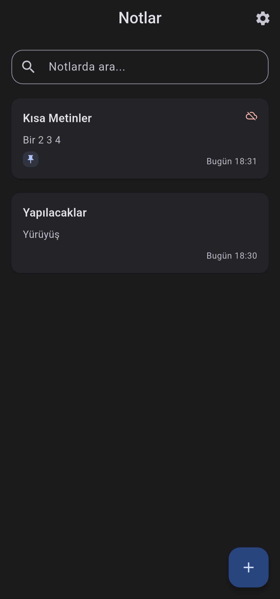
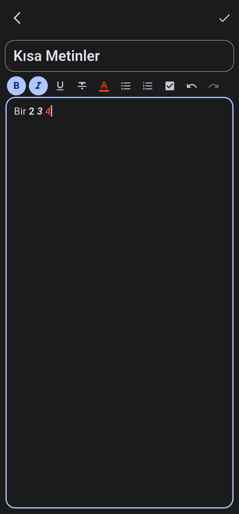

# 📝 Notlar - Güvenli Not Alma Uygulaması

)

Modern ve güvenli not alma deneyimi sunan Flutter tabanlı mobil uygulama. Notlarınızı AES-256 şifreleme ile koruyun ve Firebase ile güvenle senkronize edin.

## ✨ Özellikler

- 🔐 **Güvenli Şifreleme**: AES-256 algoritması ile tam veri koruması
- ☁️ **Bulut Senkronizasyonu**: Firebase entegrasyonu ile otomatik yedekleme
- 🎨 **Modern Tasarım**: Material Design 3 ile aydınlık/karanlık tema
- 📱 **Sezgisel Arayüz**: Kaydırma hareketleri ile hızlı işlemler
- 🔄 **Çevrimdışı Çalışma**: İnternet olmadan da notlarınızı oluşturun
- 🛡️ **Gizlilik Odaklı**: Verileriniz sadece size ait

## 📱 İndirme

**[📥 En Son Sürümü İndir](https://github.com/yusufyorunc/Notlar/releases/tag/3.0.0-(02092025))**

> **Sistem Gereksinimleri**: Android 7.0 (API 24) ve üzeri

## 📸 Uygulama Ekran Görüntüleri

  
  
  
  

## 🚀 Hızlı Başlangıç

1. **Hesap Oluşturun**: E-posta ve güvenli bir şifre ile kayıt olun
2. **İlk Notunuzu Yazın**: Ana ekrandaki + butonuna dokunun
3. **Buluta Yedekleyin**: Notunuzu sağa kaydırarak buluta gönderin
4. **Güvenle Kullanın**: Tüm verileriniz şifrelenerek korunur

## 🛠️ Teknik Detaylar

- **Platform**: Flutter (Dart)
- **Veritabanı**: SQLite + Firebase Firestore
- **Şifreleme**: AES-256
- **Kimlik Doğrulama**: Firebase Auth
